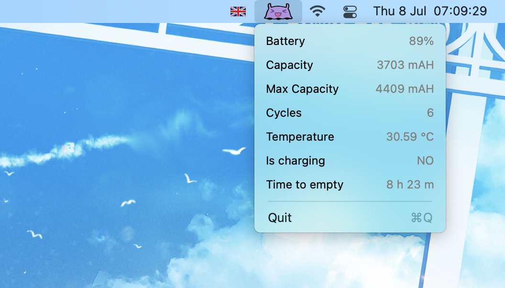
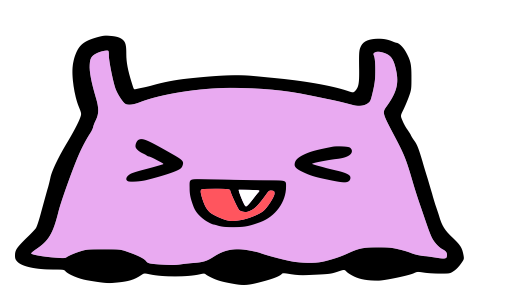
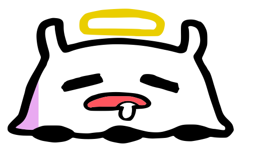
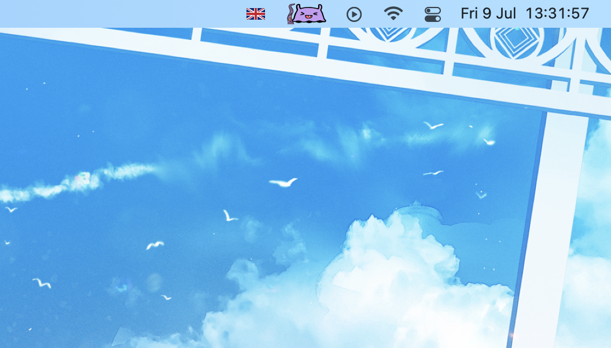

    
    <h1>Battakorey</h1>
    

        <b>Wah! Battakorey for Takodachi!</b>
  

     
     
     

# Battakorey

The purple colour and the face of the tako indicates the remaining percentage of your battakorey.

#### 70%-100%

#### 40%-70%

#### 20%-40%

#### 0%-20%

#### In charging

While in charging, there will be Tako's favourite tentacle beside it!

