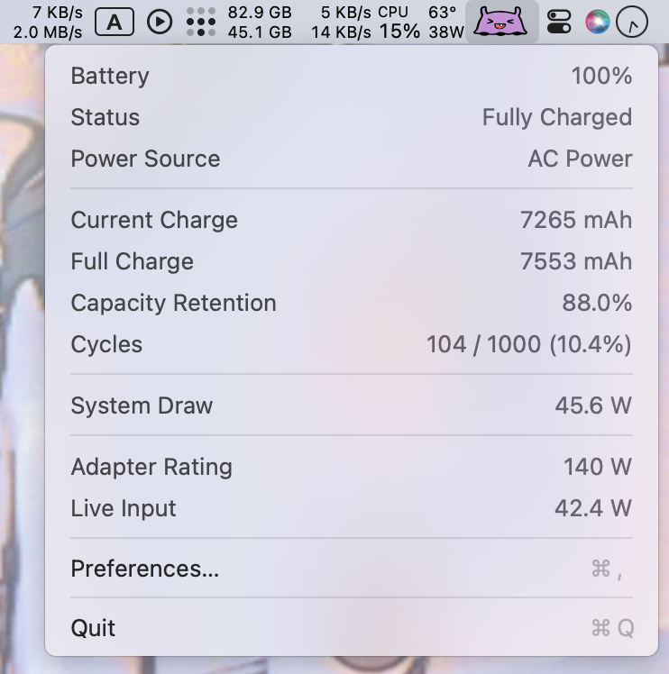
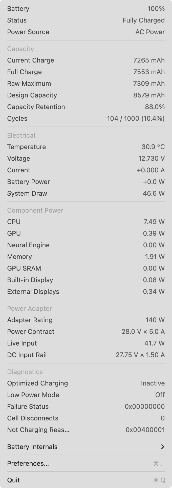
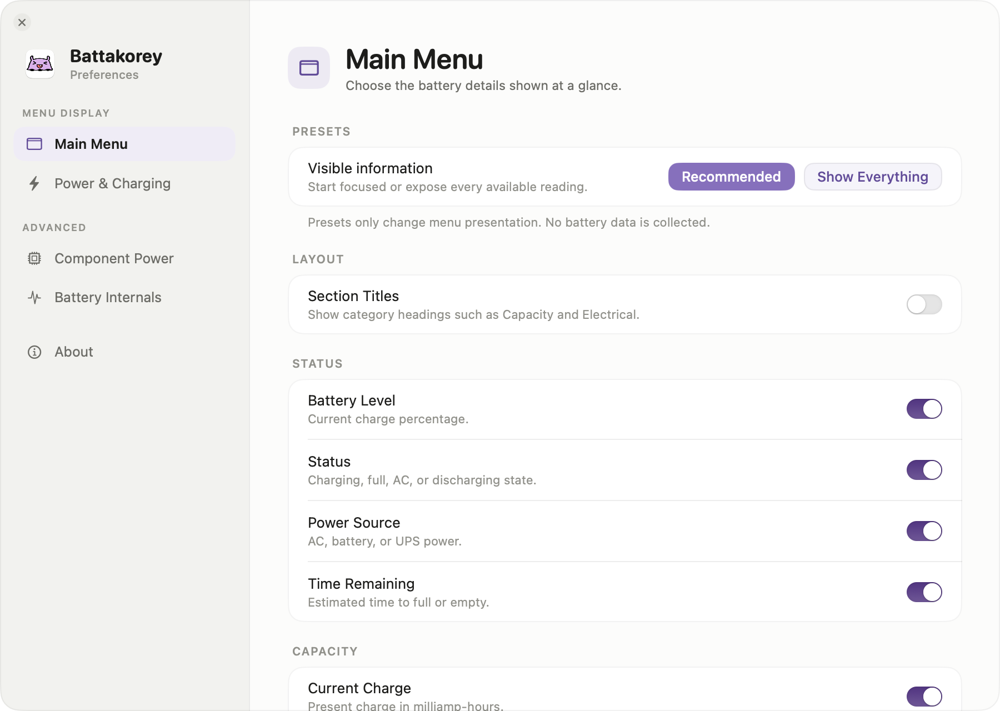

<div align="center">
    
    <h1>Battakorey</h1>
    <p>
        <b>Wah! Battakorey for Takodachi!</b>
  </p>
    <br>
    <br>
    <br>
</div>


# Battakorey

Recommended Settings:



All possible stats:



Preferences:



Requires macOS 13 or later.

The purple colour and the face of the tako indicates the remaining percentage of your battakorey.

#### 70%-100%


#### 40%-70%


#### 20%-40%


#### 0%-20%


#### In charging

While in charging, there will be Tako's favourite tentacle beside it!


## Battery data

Open the menu bar item to see live status, capacity, electrical, adapter, and diagnostic data. Preferences controls every optional row, while the Battery Internals submenu adds per-cell voltage, learned capacity, resistance, daily charge range, gauge relearn state, controller counters, and lifetime extremes when the battery controller exposes them.

Battakorey combines macOS power-source APIs with read-only `AppleSmartBattery` IORegistry properties. It also reads the `PPBR`, `VD0R`, `ID0R`, and `PDTR` AppleSMC keys for responsive battery and input power measurements. The optional Component Power section samples CPU, GPU, Neural Engine, memory, and display energy through IOReport.

AppleSMC and IOReport are undocumented interfaces that vary by hardware and macOS release. IOReport is loaded at runtime, and unavailable channels or implausible values are omitted instead of causing the app to fail.

The additional telemetry does not require root access or disabling System Integrity Protection. The app is intentionally not sandboxed, which makes this build unsuitable for Mac App Store distribution.

### References

[WhatBattery](https://github.com/darrylmorley/whatbattery) was consulted as a
reference while researching battery telemetry exposed by macOS.

## Development

Install XcodeGen and generate the Xcode project before building:

```sh
brew install xcodegen
./scripts/generate-project.sh
```

For a stable local code signature, copy `.battakorey-signing.example` to
`.battakorey-signing.local` and select a team and signing identity available in
your login keychain. The local file and generated Xcode project are ignored by
Git. Explicit `DEVELOPMENT_TEAM` and `CODE_SIGN_IDENTITY` environment variables
take precedence, allowing CI to inject signing credentials.

The test suite uses mocked IORegistry, power-source, adapter, SMC, and IOReport
payloads. It can run on CI machines without a battery:

```sh
./scripts/generate-project.sh
xcodebuild -project battakorey.xcodeproj -scheme battakorey -destination 'platform=macOS' CODE_SIGNING_ALLOWED=NO test
```
